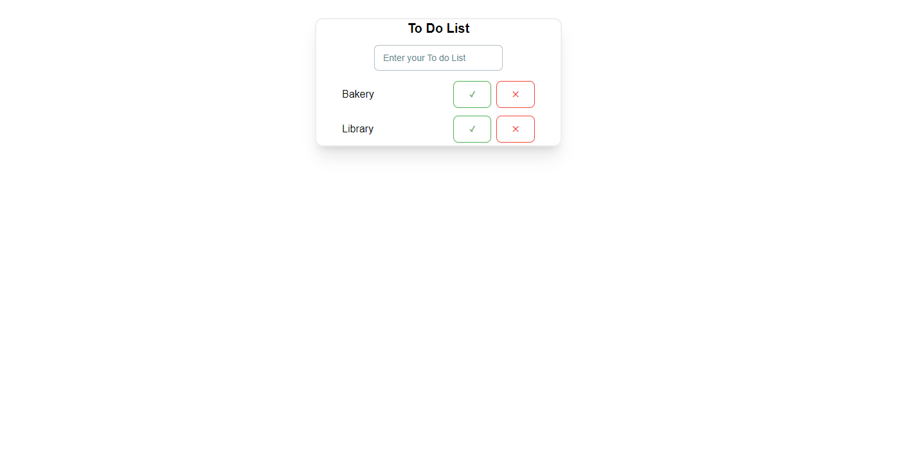

# To Do App

This is Basic To Do List Web app. In which you can add your task in the list and when your task has been completed and mark as completed and delete the task that is completed.

## Table of contents

- [Overview](#overview)
  - [Screenshot](#screenshot)
  - [Links](#links)
- [My process](#my-process)
  - [Built with](#built-with)
  - [What I learned](#what-i-learned)

## Overview

### Screenshot

### Links

- GitHub Repo URL: [Basic Quiz App Repo](https://github.com/faisgit/React-Projects/tree/main/to-do-app)
- Live Site URL: [Basic Quiz Live Url](https://react-projects-pdor.vercel.app/)

## My process

### Built with

- Semantic HTML5 markup
- CSS custom properties
- Flexbox
- CSS Grid
- Mobile-first workflow
- [React](https://react.dev/) - JS library
- [Tailwind CSS](https://tailwindcss.com/) - CSS Framework
- [Material Tailwind](https://www.material-tailwind.com/) - React framework

### What I learned

From this, Project How to use React Js and how to use ustate hook . I also learn how to use Tailwind CSS in any Project with Material Tailwind
